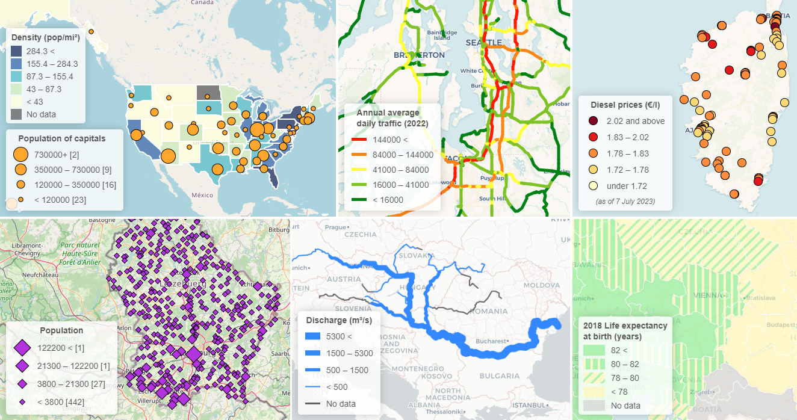

# leaflet-dataclassification

Classifies quantitative data from attributes, styles the features appropriately and also creates a clean, simple and appealing legend depicting the value classes and their associated symbols, all combined in a single step. Classifying point features can be done based on color and size, line features based on color and width, polygon features based on fill color (for choropleth maps). Extends the L.geoJSON layer.

Aims to simplify data visualization and creation of elegant thematic web maps with Leaflet using GeoJSON data, with a more traditional approach of thematic cartography. Although tutorials for defining style functions (to retrieve class colors through pre-defined conditional statements) and basic legend creation exist for Leaflet, those are static (are only created for a specific dataset) and might require using GIS software beforehand to classify and style the dataset properly (to get class boundaries and exact colors), in order to have a visualization that gets the message through. This customizable plugin automates all this and can easily be used for any dataset with quantitative data. As it extends L.GeoJSON, you can have multiple layers of this (with a matched legend for each) to create a more complex data visualization.



## Features
- Classification and styling of:
    - Point features based on color and size (graduated symbol sizes)
    - Line features based on line color and width (graduated line widths)
    - Polygon features based on fill color
- Supported classification methods (thanks to [simple-statistics.js](https://github.com/simple-statistics/simple-statistics)):
    - natural breaks (Jenks)
    - quantile
    - equal interval
- Supports ColorBrewer2 color ramps and custom color ramps (thanks to [chroma.js](https://github.com/gka/chroma.js))
- Various SVG shapes/symbols for Point features
- For size/width based symbology, min and max values can be adjusted to create a telling visualization with distinguishable classes
- Legend generation with options for:
    - class order (ascending/descending)
    - legend header (title)
    - custom HTML templating of legend rows
    - rounding of class boundary values to n decimals or up/down to the nearest 10, 100, 1000 etc. numbers
    - modifying class boundary values in legend by dividing/multiplying by a number (to easily change unit of measurement from m to km for example)
    - positioning (L.control options)

## Demo
All features in the examples listed here have binded tooltips (a default Leaflet feature) for an easier check of attribute values.
- combined (three layers): [./examples/combined.html](https://balladaniel.github.io/leaflet-dataclassification/examples/combined.html)
- points (color): [./examples/points_c.html](https://balladaniel.github.io/leaflet-dataclassification/examples/points_c.html)
- points (size, with diamond-shaped symbols): [./examples/points_s.html](https://balladaniel.github.io/leaflet-dataclassification/examples/points_s.html)
- lines (color): [./examples/lines_c.html](https://balladaniel.github.io/leaflet-dataclassification/examples/lines_c.html)
- lines (width): [./examples/lines_w.html](https://balladaniel.github.io/leaflet-dataclassification/examples/lines_w.html)
- polygons: [./examples/polygons.html](https://balladaniel.github.io/leaflet-dataclassification/examples/polygons.html)

## Requirements
- [Leaflet](https://github.com/Leaflet/Leaflet) (tested with v1.9.4)
### External dependencies
- [simple-statistics.js](https://github.com/simple-statistics/simple-statistics) (tested with v7.8.0)
- [chroma.js](https://github.com/gka/chroma.js) (tested with v2.4.0)

Include dependencies plus `leaflet-dataclassification.css` and `leaflet-dataclassification.js` in your code. You can also link them through GitHub Pages:
``` html
<link rel="stylesheet" href="https://balladaniel.github.io/leaflet-dataclassification/leaflet-dataclassification.css" />
<script src="https://balladaniel.github.io/leaflet-dataclassification/leaflet-dataclassification.js"></script>
```

## Usage example
``` javascript
const layer = L.dataClassification(data, {
    // required:
    mode: 'quantile',
    classes: 4,
    field: 'density',
    // optional:					
    pointMode: 'size',
    pointSize: {min: 2, max: 10},
    pointShape: 'square',
    lineMode: 'width',
    lineWidth: {min: 1, max: 15},
    colorRamp: 'OrRd',
    colorCustom: ['rgba(210,255,178,1)', '#fec44fff', 'f95f0eff'],  // if specified, overrides colorRamp!
    reverseColorRamp: false,
    middlePointValue: 0,
    classRounding: 2,
    legendTitle: 'Density (pop/km²)',
    legendPosition: 'bottomleft',
    legendAscending: false,	
    legendTemplate: {
        highest: '{low} and above',
        middle: '{low} – {high}',
        lowest: 'below {high}'
    },
    unitModifier: {action: 'divide', by: 1000},
    style: {
        fillColor: 'purple',    // marker fill color in point/size mode
        color: '#aabbcc',       // line stroke color in line/width mode
        weight: 5,              // line stroke weight in line/color mode
    }
}.addTo(map);
```

### Required options 
- `mode <string>`: ['jenks'|'quantile'|'equalinterval'] classification method: jenks, quantile, equalinterval
- `classes <integer>`: desired number of classes (min: 3; max: 10 or featurecount, whichever is lower. If higher, reverts back to the max of 10.)
- `field <string>`: target attribute field name to base classification on. Case-sensitive!

### Additional options (in addition to the standard L.geoJSON options)
#### Specific for Point	features
- `pointMode <string>`: ['color'|'size'] fill "color" or "size" (default: 'color')
- `pointSize <object>`: when pointMode: "size", define min/max point circle radius 
    - `min <float>`: symbol size for the lowest class. (default: 2)
    - `max <float>`: symbol size for the highest class. (default: 10)
- `pointShape <string>`: ['circle'|'square'|'diamond'] shape of points: 'circle', 'square', 'diamond' (default: 'circle')
- `style <object>`: custom styling
    - `fillColor <string>`: marker fill color, use only in size mode (default: orange)
#### Specific for Line features
- `lineMode <string>`: ['color'|'width'] stroke "color" or "width" (default: 'color')
- `lineWidth <object>`: when lineMode: "width", define min/max stroke width as object
    - `min <float>`: symbol size for the lowest class. (default: 3)
    - `max <float>`: symbol size for the highest class. (default: 15)
- `style <object>`: custom styling
    - `color <string>`: line stroke color, use only in width mode (default: blue, the L.path default)
    - `weight <float>`: line stroke weight, use only in color mode (default: 3, the L.path default)
#### General options
- `colorRamp <string>`: color ramp to use for symbology. Based on ColorBrewer2 color ramps (https://colorbrewer2.org/), included in Chroma.js. Custom colors (`colorCustom`) override this. (default: 'PuRd')
- `colorCustom <array<string>>`: custom color ramp defined as an array, colors in formats supported by Chroma.js, with opacity support. A minimum of two colors are required. If defined, custom colors override `colorRamp`. Example: ['rgba(210,255,178,1)', '#fec44fff', 'f95f0eff']. Examples for yellow in different color formats: 'ffff00', '#ff0', 'yellow', '#ffff0055', 'rgba(255,255,0,0.35)', 'hsla(58,100%,50%,0.6)', chroma('yellow').alpha(0.5). For more formats, see: https://gka.github.io/chroma.js/. For an interactive color palette helper, see: https://gka.github.io/palettes/.
- `reverseColorRamp <boolean>`: if true, reverses the chosen color ramp, both in symbology on map and legend colors. Useful when you found a great looking colorramp (green to red), but would prefer reversed colors to match visual implications about colors: green implies positive, red implies negative phenomena. (default: false)
- `middlePointValue <number>`: adjust boundary value of middle classes (only when classifying into even classes). Useful for symmetric classification of diverging data around 0. Only use a value within the range of the two middle classes.    
- `classRounding <integer>`: class boundary value rounding. When positive numbers are used for this option, class boundary values are rounded to x decimals, zero will round to whole numbers, while negative numbers will round values to the nearest 10, 100, 1000, etc. Example: with a setting of "1", a value of 254777.253 will get rounded up to 254777.3, with "0" it will be 254777, with "-2" it will become 254800. (default: null - no rounding happens, values are used as-is)
- `legendTitle <string>`: legend header (usually a description of visualized data, with a unit of measurement). HTML-markdown and styling allowed. To hide header, set this as ''. (by default it inherits target attribute field name, on which the classification is based on)
- `legendPosition <string>`: ['topleft'|'topright'|'bottomleft'|'bottomright'] legend position, L.control option. (default: 'bottomleft')
- `legendAscending <boolean>`: if true, value classes in legend will be ascending (low first, high last) (default: false)
- `legendTemplate <object>`: custom HTML formatting of legend rows using {high} and {low} placeholders (interpreted as high/low value in the context of a given class interval). Distinct formatting for the highest, lowest and middle class intervals. Middle class format requires both {high} and {low}, highest only {low} and lowest only {high}.
    - `highest <string>`: template for the upper end of classes, "highest value and above" (default: '{low} <')
    - `middle <string>`: template for rows in the middle, "low to high" (default: '{low} – {high}')
    - `lowest <string>`: template for the lower end of classes, "lowest value and below" (default: '< {high}')
- `unitModifier <object>`: modifies the final class boundary values in order to multiply/divide them by a number. Useful for example when a dataset attribute is in metres, but kilometres would fit the legend better (786000 metres shown as 786 km). Purely visual, only affects legend. Happens after classRounding.
    - `action <string>`: ['divide'|'multiply'] action to take on the number specified by `by`. Required for `unitModifier`.
    - `by <number>`: a number to divide/multiply class boundary values with. Required for `unitModifier`.